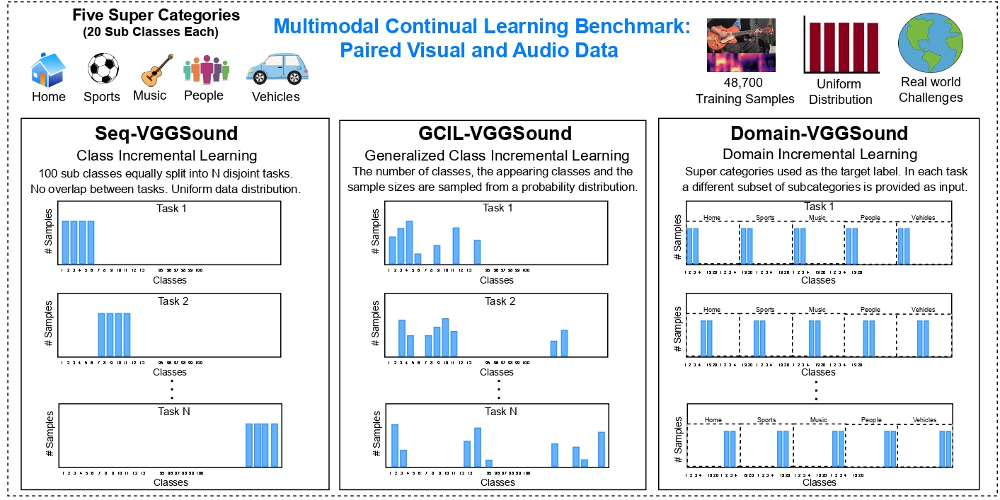
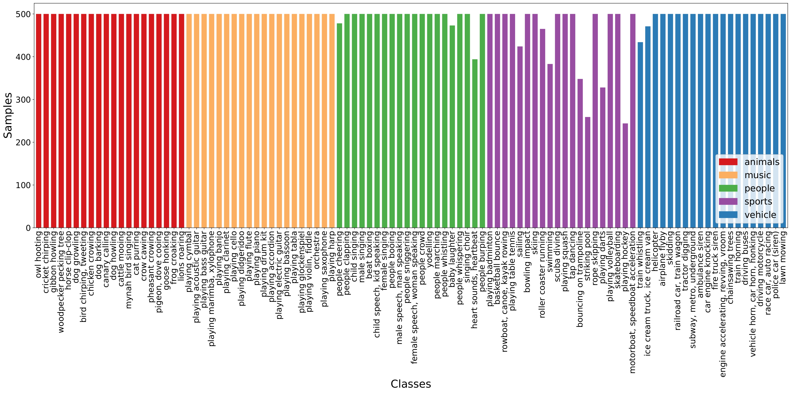

# Beyond UniModal Learning
The official PyTorch code for CoLLAs'24 Paper "Beyond Unimodal Learning: The Importance of Integrating Multiple Modalities for Lifelong Learning"

## Abstract
While humans excel at continual learning (CL), deep neural networks (DNNs) exhibit catastrophic forgetting. A salient feature of the brain that allows effective CL is that it utilizes multiple modalities for learning and inference, which is underexplored in DNNs. Therefore, we study the role and interactions of multiple modalities in mitigating forgetting and introduce a benchmark for multimodal continual learning. Our findings demonstrate that leveraging multiple views and complementary information from multiple modalities enables the model to learn more accurate and robust representations. This makes the model less vulnerable to modality-specific regularities and considerably mitigates forgetting. Furthermore, we observe that individual modalities exhibit varying degrees of robustness to distribution shift. Finally, we propose a method for integrating and aligning the information from different modalities by utilizing the relational structural similarities between the data points in each modality. Our method sets a strong baseline that enables both single- and multimodal inference. Our study provides a promising case for further exploring the role of multiple modalities in enabling CL and provides a standard benchmark for future research

# MultiModal Continual Learning Benchmark

Multimodal continual learning (MMCL) benchmark is based on a subset of the VGGSound dataset which provides a diverse collection of corresponding audio and visual cues associated with challenging objects and actions in the real world and allows the exploration of multimodal learning scenarios. To ensure accessibility to a wider research community, we select a more uniform subset from the VGGSound dataset, with a total number of samples similar to CIFAR datsets (approx. 50000 samples uniformly distributed across 100 classes), thus mitigating the requirement for extensive computational resources and memory. We present three distinct CL scenarios within the MMCL benchmark.

**Seq-VGGSound**: This scenario simulates the setting of Class-Incremental Learning (Class-IL), where a subset of 100 classes is uniformly divided into a disjoint set of N tasks. We randomly shuffled the classes and divided the dataset into 10 disjoint tasks, each containing 10 classes. 

**Dom-VGGSound**: This scenario simulates the Domain-Incremental Learning (Domain-IL) setting, where the input distribution changes while the output distribution remains the same. To achieve this, we consider the supercategory of classes as the target label, and in each subsequent task, we introduce a new set of sub-classes. We consider five supercategories (Home, Sports, Music, People, and Vehicles). 

**GCIL-VGGSound**: This scenario simulates the Generalized Class Incremental Learning setting (GCIL), which captures additional challenges encountered in real-world scenarios where task boundaries are blurry. The learning agent must learn from a continuous stream of data, where classes can reappear and have varying data distributions. It employs probabilistic modeling to randomly select classes and distributions. The quantity of classes per task is not predetermined, and there can be overlaps between classes, with varying sample sizes for each class. 

To make it easier for the research community and promote standardized testing and reproducibility, the processed dataset can be downloaded here []

# Benchmarking Models
We encourage the research community to move towards MultiModal CL and to facilitate in maintaining a fair comparison, we will be hosting the MMCL benchmark. To add your model to our benchmark, please open an issue on our repository.

<table>
  <thead>
    <tr>
      <th rowspan="2">Buffer</th>
      <th rowspan="2">Method</th>
      <th colspan="3">Seq-VGGSound</th>
      <th colspan="3">Dom-VGGSound</th>
    </tr>
    <tr>
      <th>Audio</th>
      <th>Visual</th>
      <th>Multimodal</th>
      <th>Audio</th>
      <th>Visual</th>
      <th>Multimodal</th>
    </tr>
  </thead>
  <tbody>
    <tr>
      <td rowspan="2">–</td>
      <td>JOINT</td>
      <td>53.47±1.62</td>
      <td>34.52±0.28</td>
      <td>58.21±0.24</td>
      <td>57.48±0.80</td>
      <td>42.87±2.04</td>
      <td>61.66±1.40</td>
    </tr>
    <tr>
      <td>SGD</td>
      <td>7.60±0.33</td>
      <td>6.37±0.33</td>
      <td>8.24±0.09</td>
      <td>26.89±0.17</td>
      <td>24.80±0.12</td>
      <td>27.38±0.35</td>
    </tr>
    <tr>
      <td rowspan="2">500</td>
      <td>ER</td>
      <td>13.92±1.07</td>
      <td>9.07±0.39</td>
      <td>21.44±1.76</td>
      <td>31.31±0.80</td>
      <td>27.36±1.60</td>
      <td>31.85±1.09</td>
    </tr>
    <tr>
      <td>SAMM</td>
      <td>23.61±1.06</td>
      <td>8.90±0.35</td>
      <td><strong>26.34</strong>±0.42</td>
      <td><strong>36.27</strong>±0.29</td>
      <td>24.98±0.41</td>
      <td>35.74±0.59</td>
    </tr>
    <tr>
      <td rowspan="2">1000</td>
      <td>ER</td>
      <td>18.06±0.44</td>
      <td>11.23±0.57</td>
      <td>28.09±0.77</td>
      <td>35.31±0.65</td>
      <td>27.73±0.99</td>
      <td>36.00±1.08</td>
    </tr>
    <tr>
      <td>SAMM</td>
      <td>28.59±0.77</td>
      <td>10.08±0.34</td>
      <td><strong>34.51</strong>±2.37</td>
      <td>38.63±0.43</td>
      <td>26.53±0.12</td>
      <td><strong>39.49</strong>±0.36</td>
    </tr>
    <tr>
      <td rowspan="2">2000</td>
      <td>ER</td>
      <td>23.41±0.50</td>
      <td>14.19±0.32</td>
      <td>34.02±0.40</td>
      <td>38.23±0.72</td>
      <td>29.28±0.63</td>
      <td>39.30±1.55</td>
    </tr>
    <tr>
      <td>SAMM</td>
      <td>32.20±0.28</td>
      <td>11.60±0.43</td>
      <td><strong>37.76</strong>±2.94</td>
      <td><strong>42.53</strong>±0.47</td>
      <td>28.12±0.31</td>
      <td><strong>43.72</strong>±0.34</td>
    </tr>
  </tbody>
</table>

<table>
  <thead>
    <tr>
      <th rowspan="2">Buffer</th>
      <th rowspan="2">Method</th>
      <th colspan="3"> GCIL-VGGSound (Uniform)</th>
      <th colspan="3"> GCIL-VGGSound (Longtail)</th>
    </tr>
    <tr>
      <th>Audio</th>
      <th>Visual</th>
      <th>MultiModal</th>
      <th>Audio</th>
      <th>Visual</th>
      <th>MultiModal</th>
    </tr>
  </thead>
  <tbody>
    <tr>
      <td rowspan="2">–</td>
      <td>JOINT</td>
      <td>44.02±1.51</td>
      <td>26.23±0.63</td>
      <td>49.32±0.43</td>
      <td>43.23±1.38</td>
      <td>25.19±0.76</td>
      <td>47.17±0.31</td>
    </tr>
    <tr>
      <td>SGD</td>
      <td>20.34±0.51</td>
      <td>11.47±0.79</td>
      <td>24.73±0.40</td>
      <td>19.00±0.43</td>
      <td>10.43±0.67</td>
      <td>22.03±0.67</td>
    </tr>
    <tr>
      <td rowspan="2">500</td>
      <td>ER</td>
      <td>24.57±0.44</td>
      <td>13.80±0.53</td>
      <td>29.76±0.82</td>
      <td>24.30±0.33</td>
      <td>12.81±0.11</td>
      <td>28.58±0.73</td>
    </tr>
    <tr>
      <td>SAMM</td>
      <td>27.41±0.41</td>
      <td>11.90±1.65</td>
      <td><strong>34.34</strong>±0.78</td>
      <td>27.25±0.65</td>
      <td>12.06±0.22</td>
      <td><strong>34.16</strong>±0.81</td>
    </tr>
    <tr>
      <td rowspan="2">1000</td>
      <td>ER</td>
      <td>27.32±0.38</td>
      <td>15.53±0.30</td>
      <td>34.27±0.77</td>
      <td>27.25±0.93</td>
      <td>14.24±0.25</td>
      <td>31.60±0.94</td>
    </tr>
    <tr>
      <td>SAMM</td>
      <td>29.99±0.41</td>
      <td>13.18±0.64</td>
      <td><strong>38.04</strong>±1.51</td>
      <td>28.52±0.40</td>
      <td>12.64±0.12</td>
      <td><strong>36.15</strong>±0.30</td>
    </tr>
    <tr>
      <td rowspan="2">2000</td>
      <td>ER</td>
      <td>31.30±0.28</td>
      <td>17.25±0.09</td>
      <td>37.77±0.80</td>
      <td>29.75±0.46</td>
      <td>17.31±0.21</td>
      <td>35.66±0.53</td>
    </tr>
    <tr>
      <td>SAMM</td>
      <td>31.96±0.76</td>
      <td>14.35±0.58</td>
      <td><strong>42.08</strong>±1.89</td>
      <td>30.13±0.68</td>
      <td>13.09±0.57</td>
      <td><strong>40.33</strong>±0.38</td>
    </tr>
  </tbody>
</table>

# Setup
## Setup

+ Use `python main.py` to run experiments.
+ Use argument `--load_best_args` to use the best hyperparameters for each of the evaluation setting from the paper.
+ To reproduce the results in the paper run the following  

    `python main.py --dataset <dataset> --model <model> --buffer_size <buffer_size> --load_best_args`

# Acknowledgement
We would like to acknowledge the great repos that enabled us to build our framework on top of:
- [mammoth](https://github.com/aimagelab/mammoth)
- [VGGSound] (https://github.com/hche11/VGGSound) 

# Cite our work
If you find our work and/or multimodal benchmark useful in your research, please consider citing us 

    @article{sarfraz2024beyond,
      title={Beyond Unimodal Learning: The Importance of Integrating Multiple Modalities for Lifelong Learning},
      author={Sarfraz, Fahad and Zonooz, Bahram and Arani, Elahe},
      journal={arXiv preprint arXiv:2405.02766},
      year={2024}
    }
